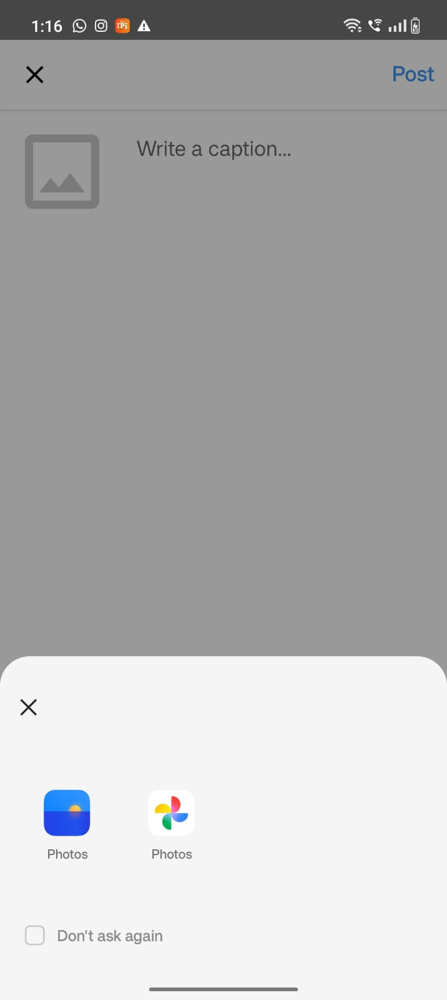
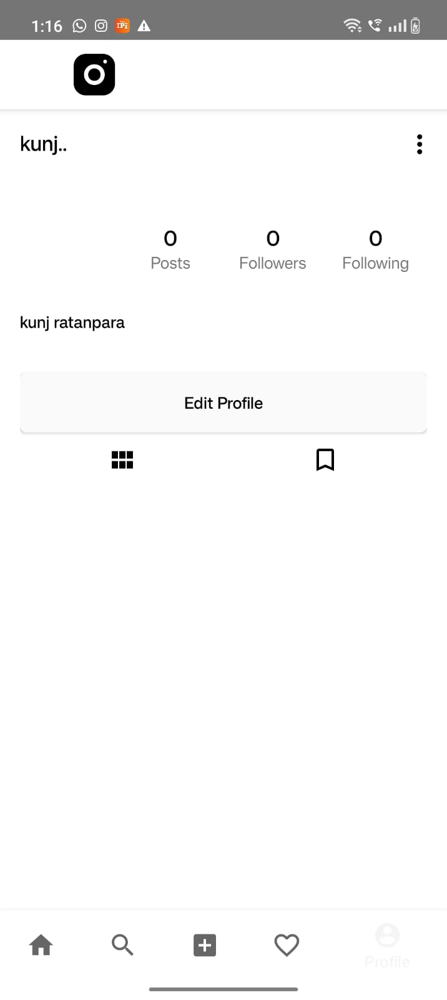

# 📸 InstaClone (Instagram Clone)

A modern Android social media application inspired by Instagram, developed using **Java** and **Firebase**.

---

## 🚀 Features

* 🔐 User Authentication (Login & Register)
* 📷 Upload Images with Captions
* 🏠 Real-time Feed
* ❤️ Like System
* 💬 Comment System
* 👤 User Profile
* ➕ Follow / Unfollow Users

---

## 📸 Screenshots

### 🏠 Home Feed

### 📷 Upload Post

### 👤 Profile Screen

### 🔐 Login Screen

---

## 🛠 Tech Stack

* Java (Android)
* XML (UI Design)
* Firebase Authentication
* Firebase Realtime Database
* Firebase Storage

---

## 📂 Project Structure

* `activities/` → App screens
* `adapters/` → RecyclerView adapters
* `models/` → Data models
* `firebase/` → Firebase integration

---

## 👨‍💻 Developer

* Kunj Ratanpara

---

## 📌 How to Run

1. Clone the repository
2. Open in Android Studio
3. Connect Firebase project
4. Run on emulator or device

